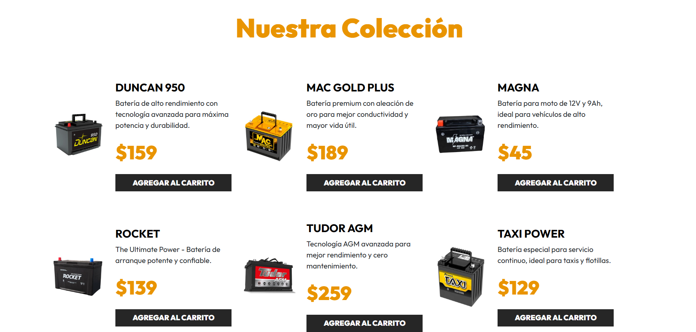
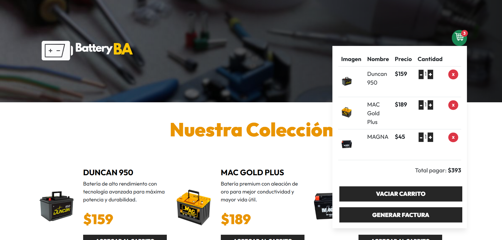

# BatteryBA — Battery Store

A small e-commerce single-page application for selling car and motorcycle batteries.
Browse the catalog, manage a shopping cart that persists across reloads, and download a
PDF invoice (with VAT) for your order.

Built with **React 18 + Vite** as a front-end project to practice component architecture,
custom hooks and client-side state management.

> **Live demo:** <https://batteryba.netlify.app/>

## Screenshots

**Product catalog**



**Cart with items and invoice actions**



## Features

- 🛒 **Shopping cart** — add products, increase/decrease quantity and remove items.
- 💾 **Persistent state** — the cart is saved to `localStorage`, so it survives a page reload.
- 🧾 **PDF invoice** — generate and download an invoice with line items, subtotal, 21% VAT and total (`jsPDF` + `jspdf-autotable`).
- 🔔 **Toast notifications** — feedback on every cart action (`react-toastify`).
- 📱 **Responsive & accessible** — cart opens on hover (desktop) or click/keyboard (mobile), with `aria-label`s on interactive controls.

## Tech stack

- [React 18](https://react.dev/)
- [Vite 6](https://vitejs.dev/) (with `@vitejs/plugin-react-swc`)
- [jsPDF](https://github.com/parallax/jsPDF) + [jspdf-autotable](https://github.com/simonbengtsson/jsPDF-AutoTable)
- [react-toastify](https://fkhadra.github.io/react-toastify/)
- [Vitest](https://vitest.dev/) + [React Testing Library](https://testing-library.com/) for testing
- [ESLint 9](https://eslint.org/)
- Bootstrap-derived utility classes (vendored in `src/index.css`)

## Project structure

```
src/
├── components/
│   ├── Battery.jsx          # Single product card
│   ├── Battery.test.jsx     # Component test
│   └── Header.jsx           # Header + cart dropdown + PDF invoice
├── data/
│   └── db.js                # In-memory product catalog
├── hooks/
│   ├── useCart.js           # Cart logic (add/remove/quantity, localStorage)
│   └── useCart.test.js      # Hook unit tests
├── test/
│   └── setup.js             # Vitest setup (jest-dom, mocks)
├── App.jsx                  # Composition root
├── main.jsx                 # React entry point
└── index.css                # Styles
public/img/                  # Product and UI images
```

## Getting started

**Requirements:** Node.js 18+ and npm.

```bash
# 1. Install dependencies
npm install

# 2. Start the dev server
npm run dev
```

Then open the URL printed in the terminal (Vite defaults to <http://localhost:5173>).

### Available scripts

| Script            | Description                          |
| ----------------- | ------------------------------------ |
| `npm run dev`           | Start the Vite dev server              |
| `npm run build`         | Build for production into `dist/`      |
| `npm run preview`       | Preview the production build locally   |
| `npm run lint`          | Run ESLint                             |
| `npm test`              | Run the test suite once                |
| `npm run test:watch`    | Run tests in watch mode                |
| `npm run test:coverage` | Run tests with a coverage report       |

## Testing

Tests are written with [Vitest](https://vitest.dev/) and
[React Testing Library](https://testing-library.com/docs/react-testing-library/intro/)
(jsdom environment).

```bash
npm test
```

Coverage focuses on the cart logic, which is the heart of the app:

- `src/hooks/useCart.test.js` — add, increment, remove, quantity bounds, "empty cart", `localStorage` persistence and rehydration, and a regression test ensuring the catalog objects are never mutated. The `useCart` hook sits at **~97% coverage**.
- `src/components/Battery.test.jsx` — rendering, accessible image alt text, and that clicking "Agregar al Carrito" calls `addToCart` with the right payload.

## Deployment

This is a static SPA, so it can be hosted on any static host. Config files for the two
most common options are included.

**Vercel** (`vercel.json` included)
1. Push the repository to GitHub.
2. Import the project at [vercel.com/new](https://vercel.com/new).
3. Vercel auto-detects Vite — just deploy. The build command is `npm run build` and the output directory is `dist`.

**Netlify** (`netlify.toml` included)
1. Push the repository to GitHub.
2. "Add new site" → import from Git at [app.netlify.com](https://app.netlify.com/).
3. Build command `npm run build`, publish directory `dist` (already set in `netlify.toml`).

After deploying, paste the URL into the **Live demo** link at the top of this file.

## Possible improvements

Ideas to take this further: product search/filtering, a real backend + checkout, and a
"stock" / "already in cart" indicator on each product card.

## License

Released under the [MIT License](LICENSE).
